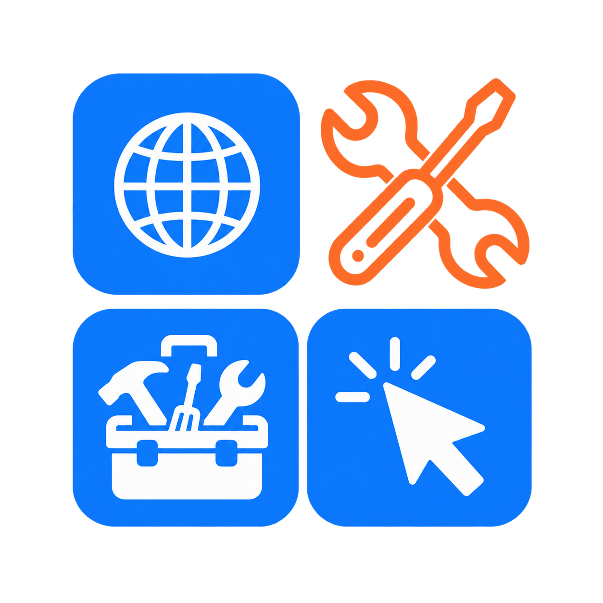

<p align="center">
  
</p>

<h1 align="center">EveryKit</h1>

<p align="center">
  Small, single-purpose web tools that each finish one everyday task in about a
  minute. Free, and your files never leave your device.
</p>

<p align="center">
  <a href="LICENSE"></a>
  
  
</p>

---

EveryKit is a family of tiny web utilities built by [Reivex](https://reivex.io).
Each one solves a single painful task, works on a phone as well as a computer,
and is free to use with no account.

The point of the product is also the reason it costs almost nothing to run:
**every file is processed in the browser tab and never uploaded.** A passport
photo, a PDF, a scanned document, a signature. It is read from the device,
worked on there, and saved back, and no server ever sees it.

## Privacy architecture

The privacy promise is kept by the shape of the system, not by a setting.

- **Files stay on the device.** Image, PDF and audio processing all run
  client-side with WebAssembly and the Canvas APIs. There is no server-side file
  handling anywhere in the codebase.
- **One database table, and it holds one thing.** The only personal data the
  platform stores is an email address, offered by the user at the moment they
  take a result, and always skippable. Kits never hold database credentials;
  they post to a single endpoint on the hub, which owns the table.
- **Aggregate measurement only.** No third-party analytics, no tracking script,
  no cookie, nothing per-person. The one measurement that exists is the hub's own
  hit counter, which increments an aggregate `(day, kit, path, count)` row and
  reads nothing about the caller.
- **No paid or proprietary services.** Every dependency is free and open source,
  so the whole platform runs on a single self-hosted server.

## The apps

One hub and fourteen kits, each on its own subdomain.

| App | Folder | Subdomain | What it does |
| --- | --- | --- | --- |
| Hub | [`hub/`](hub) | useeverykit.com | The directory, `/kits.json`, the shared endpoints and the admin dashboard |
| Photos | [`photos/`](photos) | photos.useeverykit.com | Passport and visa photos cropped from a selfie |
| Letters | [`letters/`](letters) | letters.useeverykit.com | Formal letters assembled from a short form |
| PDF | [`pdf/`](pdf) | pdf.useeverykit.com | Merge, split, scan, OCR and shrink PDFs |
| QR | [`qr/`](qr) | qr.useeverykit.com | QR codes for links, Wi-Fi, contacts and more |
| Images | [`images/`](images) | images.useeverykit.com | Resize, convert, crop and compress photos |
| Background | [`background/`](background) | background.useeverykit.com | Remove a background or replace it with solid white |
| Text | [`text/`](text) | text.useeverykit.com | Count, convert and clean up text |
| Sign | [`sign/`](sign) | sign.useeverykit.com | Draw a signature and sign a PDF |
| Invoice | [`invoice/`](invoice) | invoice.useeverykit.com | Invoices, quotes and receipts as PDFs |
| Ringtone | [`ringtone/`](ringtone) | ringtone.useeverykit.com | Trim any song into a ringtone |
| Dev | [`dev/`](dev) | dev.useeverykit.com | Small developer tools (JSON, base64, JWT and more) |
| Study | [`study/`](study) | study.useeverykit.com | Calculators and helpers for students |
| Calc | [`calc/`](calc) | calc.useeverykit.com | Everyday calculators that just answer |
| Teach | [`teach/`](teach) | teach.useeverykit.com | Classroom tools that save teachers time |

Each kit has its own `README.md` with the detail of how it works.

## Tech stack

- **Next.js 15** (App Router) and **React**, in **TypeScript** (strict).
- **Tailwind CSS** for styling, with a shared token set (see
  [CONTRIBUTING.md](CONTRIBUTING.md#design-system)).
- **IBM Plex Sans** via `next/font/google`, icons from **lucide-react**.
- **PostgreSQL** for the single email table, reached only through the hub.
- Client-side processing with **WebAssembly** and the Canvas and Web Audio APIs.
- Self-hosted: **PM2** processes behind **nginx** on one server.

## Running locally

You need Node 20+ and npm. Each app is its own npm project:

```bash
cd photos
npm install
npm run dev
```

The hub additionally needs Postgres for its endpoints and dashboard. A local
instance is provided via Docker:

```bash
docker compose up -d
psql "$DATABASE_URL" -f db/schema.sql
cd hub && npm install && npm run dev
```

Copy the `.env.example` in any app to `.env.local` before running it. Full setup,
the design system and the quality gate are in [CONTRIBUTING.md](CONTRIBUTING.md).

## How it all fits together

The apps share no runtime code. Consistency comes from the conventions in
[CONTRIBUTING.md](CONTRIBUTING.md), not from a package, which keeps each app
independently deployable.

```
hub/          the platform: directory, /kits.json, /api/subscribe, /api/hit, /admin
<kit>/        one Next.js app per tool, standalone
db/           the one table, and its schema
deploy/       nginx config and the edge helper that manages TLS
brand/        shared brand marks
```

The hub's [`data/kits.ts`](hub/data/kits.ts) is the single source of truth for
the directory, the `/kits.json` registry every kit reads, the search, and the
cross-promotion strips.

## Deployment

Everything runs on one server: a PM2 process per app on a localhost port, all
behind nginx, with Postgres on the same box listening on localhost only.
[`ecosystem.config.js`](ecosystem.config.js) defines the processes and
[`deploy.sh`](deploy.sh) builds and reloads only the apps that changed. A
wildcard `*.useeverykit.com` DNS record resolves every subdomain, and
[`deploy/edge.sh`](deploy/edge.sh) expands the TLS certificate when a new
hostname first appears.

## Contributing

Contributions are welcome. Please read [CONTRIBUTING.md](CONTRIBUTING.md) and our
[Code of Conduct](CODE_OF_CONDUCT.md) first.

## License

[MIT](LICENSE) © Reivex
